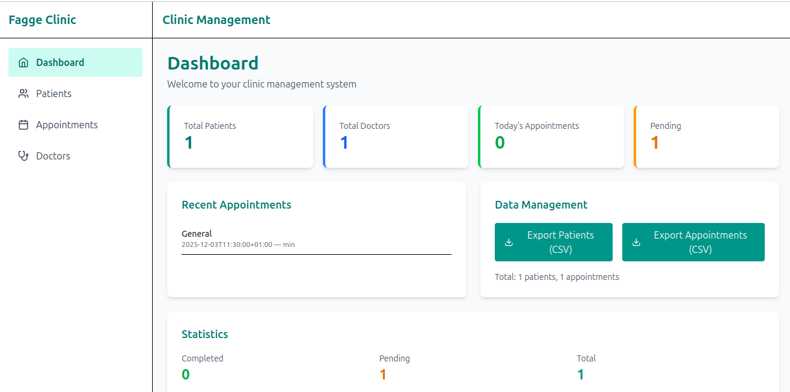

# 🏥 Clinic Management Application

A comprehensive, full-featured clinic and patient management system built with **React 19**, **TypeScript**, and **Tailwind CSS**. This single-page application (SPA) provides complete CRUD operations for patients, doctors, and appointments with advanced features like appointment scheduling conflict detection, CSV export, and a responsive design for mobile, tablet, and desktop devices.




## 📋 Table of Contents

- [Features](#features)
- [Tech Stack](#tech-stack)
- [Project Structure](#project-structure)
- [Installation & Setup](#installation--setup)
- [Running the Application](#running-the-application)
- [Core Architecture](#core-architecture)
- [Data Models](#data-models)
- [Key Features & Usage](#key-features--usage)
- [Component Documentation](#component-documentation)
- [Store & State Management](#store--state-management)
- [Utilities](#utilities)
- [Styling & Theme](#styling--theme)
- [Mobile Responsiveness](#mobile-responsiveness)
- [Browser Support](#browser-support)
- [Troubleshooting](#troubleshooting)

## ✨ Features

### Core Functionality
- ✅ **Patient Management**: Create, read, update, and delete patient records with full contact and medical history
- ✅ **Doctor Management**: Manage doctor profiles with specialization, contact details
- ✅ **Appointment Scheduling**: Schedule appointments with duration-based conflict detection
- ✅ **Medical Records**: Track patient medical history, allergies, and conditions
- ✅ **Appointment Calendar**: Visual 7-day and full-month calendar views
- ✅ **Search & Filter**: Quick search across patients, doctors, and appointments

### Advanced Features
- ✅ **Conflict Detection**: Interval-based appointment overlap prevention with visual indicators
- ✅ **CSV Export**: Export patient and appointment data to CSV format
- ✅ **Data Persistence**: localStorage-backed persistence via Zustand
- ✅ **Confirmation Dialogs**: Safe delete operations with confirmation prompts
- ✅ **Toast Notifications**: Real-time feedback for user actions
- ✅ **Responsive Design**: Mobile-first responsive layout (mobile, tablet, desktop)

## 🛠️ Tech Stack

| Layer | Technology | Version |
|-------|-----------|---------|
| **UI Framework** | React | 19.2 |
| **Language** | TypeScript | 5.6 |
| **Build Tool** | Vite | 7.2 |
| **Routing** | React Router | 6.18 |
| **State Management** | Zustand | 4.4 |
| **Form Handling** | React Hook Form | 7.50 |
| **Styling** | Tailwind CSS | 4.1 |
| **CSS Processing** | PostCSS + @tailwindcss/postcss | 8.4 |
| **Icons** | lucide-react | 0.276 |
| **Date Utilities** | date-fns | 4.1 |
| **ID Generation** | UUID | 9.0 |
| **Calendar** | react-big-calendar | 1.7 |
| **Package Manager** | yarn | - |

## 📁 Project Structure

```
clinic-management-application/
├── index.html                          # HTML entry point
├── package.json                        # Dependencies
├── vite.config.js                      # Vite configuration
├── tsconfig.json                       # TypeScript configuration
├── postcss.config.cjs                  # PostCSS configuration (Tailwind)
├── tailwind.config.cjs                 # Tailwind CSS configuration
├── eslint.config.js                    # ESLint rules
│
├── public/                             # Static assets
│
└── src/
    ├── main.tsx                        # React entry point (Router + Providers)
    ├── App.tsx                         # Route definitions
    ├── App.css                         # Global styles
    ├── index.css                       # Tailwind imports
    │
    ├── types.ts                        # TypeScript interfaces & constants
    │
    ├── components/
    │   ├── Layout.tsx                  # Main layout wrapper (Sidebar + Header)
    │   ├── Sidebar.tsx                 # Navigation sidebar
    │   ├── Header.tsx                  # Top navigation bar
    │   ├── ConfirmProvider.tsx         # Confirmation dialog provider
    │   ├── ToastProvider.tsx           # Toast notification provider
    │   └── DataManagement.tsx          # CSV export UI
    │
    ├── pages/
    │   ├── Dashboard.tsx               # Dashboard with metrics & recent activity
    │   │
    │   ├── Patients/
    │   │   ├── PatientsList.tsx        # Patient list with search & CRUD actions
    │   │   ├── PatientForm.tsx         # Create/edit patient form
    │   │   └── PatientProfile.tsx      # Patient details & appointments
    │   │
    │   ├── Doctors/
    │   │   ├── DoctorsList.tsx         # Doctor list with CRUD actions
    │   │   ├── DoctorForm.tsx          # Create/edit doctor form
    │   │   └── DoctorProfile.tsx       # Doctor details & appointments
    │   │
    │   └── Appointments/
    │       ├── AppointmentsList.tsx    # Appointment list with filtering
    │       ├── AppointmentForm.tsx     # Schedule appointment with conflict detection
    │       ├── AppointmentCalendar.tsx # 7-day calendar grid view
    │       └── BigCalendar.tsx         # Full month calendar view
    │
    ├── store/
    │   └── useStore.ts                 # Zustand store (CRUD & persistence)
    │
    ├── utils/
    │   ├── appointmentOverlap.ts       # Conflict detection logic
    │   └── csvExport.ts                # CSV generation & download
    │
    └── assets/
        └── (images, icons, etc.)
```

## 🚀 Installation & Setup

### Prerequisites
- Node.js 16+ (or 18+ for best compatibility)
- yarn or npm

### Step 1: Clone & Install Dependencies

```bash
cd clinic-management-application
yarn install
# or
npm install
```

### Step 2: Verify TypeScript Setup

The project uses incremental TypeScript migration with `allowJs: true` in `tsconfig.json`. Existing `.jsx` files can coexist with `.tsx` files.

### Step 3: Verify Environment

```bash
# Check Node version
node --version  # Should be 16+

# Check yarn/npm
yarn --version
# or npm --version
```

## 🏃 Running the Application

### Development Server

```bash
yarn dev
# or
npm run dev
```

The app will be available at `http://localhost:5173` (or the next available port).

**Features:**
- Hot Module Replacement (HMR) for instant code updates
- Fast refresh for React components
- TypeScript checking on save

### Production Build

```bash
yarn build
# or
npm run build
```

Output is in `dist/` directory.

```bash
# Preview production build
yarn preview
# or
npm run preview
```

### Linting

```bash
yarn lint
# or
npm run lint
```

## 🏗️ Core Architecture

### Application Flow

```
index.html
    ↓
main.tsx (Entry Point)
    ├── BrowserRouter (React Router)
    └── Providers (nested)
        ├── ToastProvider (notifications)
        ├── ConfirmProvider (confirmations)
        └── App.tsx (Routes)
            ├── Layout (wrapper)
            │   ├── Header (top nav)
            │   ├── Sidebar (left nav)
            │   └── <Outlet /> (page content)
            └── Routes
                ├── / → Dashboard
                ├── /patients → PatientsList
                ├── /patients/new → PatientForm (create)
                ├── /patients/:id → PatientProfile (view)
                ├── /doctors → DoctorsList
                ├── /doctors/new → DoctorForm (create)
                ├── /doctors/:id → DoctorProfile (view)
                ├── /appointments → AppointmentsList
                ├── /appointments/new → AppointmentForm (create)
                ├── /appointments/calendar → AppointmentCalendar
                └── /appointments/bigcal → BigCalendar
```

### Data Flow

```
Component
    ↓ (reads/subscribes)
Zustand Store (useStore)
    ├── State: patients, doctors, appointments
    ├── Actions: addPatient, updatePatient, removePatient, etc.
    └── Persistence: localStorage via persist middleware
    ↓ (stores)
localStorage: clinic-storage
```

### Provider Pattern

```
ToastProvider
├── useToast() → { toast: (msg: string) => void }
└── Toast appears fixed bottom-right, auto-dismisses after 4s

ConfirmProvider
├── useConfirm() → { confirm: (msg: string) => Promise<boolean> }
└── Modal overlay blocks interaction until confirmed
```

## 📊 Data Models

### Patient

```typescript
interface Patient {
  id: string                           // UUID
  fullName: string
  dateOfBirth: string                  // ISO date
  gender: string                       // Male, Female, Other
  phone: string
  email: string
  address?: string
  emergencyContact: {
    name?: string
    phone?: string
  }
  medicalHistory?: string              // Long text field
  assignedDoctorId?: string            // Reference to doctor
  createdAt: string                    // ISO timestamp
}
```

### Doctor

```typescript
interface Doctor {
  id: string                           // UUID
  name: string
  specialization: string               // e.g., Cardiology, Pediatrics
  phone: string
  email: string
}
```

### Appointment

```typescript
interface Appointment {
  id: string                           // UUID
  patientId: string                    // Reference to patient
  doctorId: string                     // Reference to doctor
  dateTime: string                     // ISO datetime
  durationMinutes: number              // 15, 30, 45, 60, etc.
  type: string                         // e.g., Checkup, Surgery, Consultation
  reason: string                       // Detailed reason for visit
  status: 'scheduled' | 'completed' | 'cancelled'
}
```

### Medical Record (Future)

```typescript
interface MedicalRecord {
  id: string
  patientId: string
  date: string
  diagnosis: string
  prescription: string
  notes: string
}
```

## 🎯 Key Features & Usage

### 1. Patient Management

**Create Patient:**
1. Navigate to Patients → New Patient
2. Fill form (name, DOB, gender, phone, email, address)
3. Add emergency contact info (optional)
4. Add medical history (allergies, conditions)
5. Click "Create Patient"

**View/Edit:**
- Click patient name in list to view profile
- Shows all appointments for the patient
- Assigned doctor displayed

**Delete Patient:**
- Click delete icon in patient list
- Confirm deletion (irreversible)

**Search Patients:**
- Use search box to filter by name, phone, or email
- Filters applied in real-time

### 2. Doctor Management

**Add Doctor:**
1. Navigate to Doctors → Add Doctor
2. Enter name, specialization, phone, email
3. Click "Create Doctor"

**View Doctor Profile:**
- Shows all appointments for that doctor
- Can see patient names and appointment times

**Delete Doctor:**
- Confirm deletion (appointments remain but doctor link removed)

### 3. Appointment Scheduling

**Schedule Appointment:**
1. Navigate to Appointments → Schedule
2. Select patient and doctor (required)
3. Choose date and time
4. Set duration (15-480 minutes)
5. Enter appointment type (e.g., "Checkup")
6. Add reason/notes (optional)
7. System checks for conflicts automatically
8. If conflicts exist, red warning displays conflicting times
9. Fix conflicts or try different time
10. Click "Schedule"

**Conflict Detection:**
- Interval-based: checks if new appointment overlaps with any existing appointments for that doctor
- Example: If Dr. Smith has appointment 2:00-2:30 PM, can't schedule another at 2:15 PM
- Conflicts shown in red on calendars with alert icon
- AppointmentsList highlights conflict rows

**View Appointment Status:**
- Scheduled (blue badge)
- Completed (green badge)
- Cancelled (gray badge)

**Update Appointment:**
- Mark as Completed: Changes status to "completed", turns green
- Cancel: Changes status to "cancelled", turns gray
- Delete: Permanently removes appointment

### 4. Calendar Views

**7-Day Calendar:**
- Shows next 7 days in grid
- Mobile: 2 columns, Tablet: 3 columns, Desktop: 7 columns
- Each day shows appointments for that day
- Hover to see full details

**Big Calendar (Month View):**
- Full month view with react-big-calendar
- Click event to see details
- Color coded:
  - Teal: Normal scheduled appointment
  - Green: Completed appointment
  - Red: Scheduling conflict
  - Gray: Cancelled appointment

### 5. Data Export

**Export to CSV:**
1. Navigate to Dashboard
2. Click "Download Patients CSV" or "Download Appointments CSV"
3. CSV file downloads with all data
4. Open in Excel, Google Sheets, or any CSV reader

**CSV Format:**

Patients CSV:
```
Full Name,Date of Birth,Gender,Phone,Email,Assigned Doctor
John Doe,1990-05-15,Male,555-0123,john@example.com,Dr. Smith
```

Appointments CSV:
```
Date/Time,Patient,Doctor,Type,Duration (min),Status
2024-12-02T14:00:00Z,John Doe,Dr. Smith,Checkup,30,scheduled
```

## 🧩 Component Documentation

### Layout Components

#### Layout.tsx
**Purpose:** Main layout wrapper with responsive sidebar

**Props:** None

**Features:**
- Fixed sidebar on mobile (toggleable), static on desktop
- Mobile menu button (hamburger icon)
- Overlay when sidebar open on mobile
- Header with title
- Outlet for page content

**Responsive:**
- Mobile: Sidebar fixed, off-canvas, toggleable
- Desktop (md+): Sidebar static, always visible

#### Sidebar.tsx
**Purpose:** Navigation menu

**Props:**
- `onClose?: () => void` - Callback to close sidebar (mobile)

**Links:**
- Home (Dashboard)
- Patients (list)
- Doctors (list)
- Appointments (list)
- Appointments Calendar

**Styling:**
- Active link highlighted in teal
- Icons from lucide-react
- Responsive font sizes

#### Header.tsx
**Purpose:** Top navigation bar

**Props:** None

**Features:**
- Displays page title
- Menu toggle button on mobile
- "New" button for quick access (hidden on mobile)

### Page Components

#### Dashboard.tsx

**Displays:**
- Total patients count
- Total doctors count
- Today's appointment count
- Pending appointment count
- Recent appointments (last 5)
- Appointment statistics (completed, pending, total)
- Data management section (CSV export)

**Responsive:**
- Metric cards: 1 col (mobile) → 2 cols (tablet) → 4 cols (desktop)
- Layout: 2-column grid on desktop, stacked on mobile

#### PatientsList.tsx

**Features:**
- Searchable list (name, phone, email)
- Table view on desktop
- Card view on mobile
- Action icons: View, Delete
- Assigned doctor displayed

**Responsive:**
- Desktop: Full HTML table with all columns
- Mobile: Card layout with key info, actions on right

#### PatientForm.tsx

**Fields:**
- Full Name (required)
- Date of Birth (required)
- Gender (required)
- Phone (required)
- Email (required)
- Address (optional)
- Emergency Contact Name & Phone (optional)
- Medical History (optional, textarea)

**Validation:**
- React Hook Form with built-in validation
- Error messages display below each field
- Required fields marked with *

#### AppointmentForm.tsx

**Fields:**
- Patient (required, dropdown)
- Doctor (required, dropdown)
- Date (required)
- Time (required)
- Duration in minutes (required, min 15)
- Type (required)
- Reason (optional, textarea)

**Conflict Detection:**
- On submit, checks for overlapping appointments
- Shows red alert with conflicting times if found
- Prevents scheduling if conflicts exist
- User must choose different time

**Responsive:**
- Single column mobile, 2 columns desktop
- Error messages below fields

#### AppointmentsList.tsx

**Features:**
- Searchable/filterable (by patient, doctor, type, reason, date)
- Status filter (all, scheduled, completed, cancelled)
- Table view on desktop
- Card view on mobile
- Conflict indicator (red background + alert icon)
- Status badges (blue, green, gray)
- Action icons: Complete, Cancel, Delete

**Responsive:**
- Desktop: 7-column table
- Mobile: Full-width cards with key info and action buttons

#### AppointmentCalendar.tsx

**7-Day Grid:**
- Shows next 7 days
- Each cell shows appointments for that day
- Responsive columns

**Responsive:**
- Mobile: 2 columns
- Tablet: 3 columns
- Desktop: 7 columns (full week)

#### BigCalendar.tsx

**Features:**
- Full month calendar view
- react-big-calendar integration
- Event colors indicate status/conflicts
- Responsive height calculation

**Colors:**
- Teal: Normal scheduled
- Green: Completed
- Red: Conflict
- Gray: Cancelled

### Provider Components

#### ConfirmProvider.tsx

**Usage:**
```typescript
const { confirm } = useConfirm()

const ok = await confirm.confirm('Delete this item?')
if (ok) {
  // User confirmed
  deleteItem()
}
```

**Features:**
- Modal overlay
- Yes/No buttons
- Blocks interaction until answered
- Returns Promise<boolean>

#### ToastProvider.tsx

**Usage:**
```typescript
const { toast } = useToast()

toast.toast('Operation successful!')
```

**Features:**
- Fixed bottom-right position
- Auto-dismisses after 4 seconds
- Stacks multiple toasts
- Smooth animations

### Utility Components

#### DataManagement.tsx

**Features:**
- Download Patients CSV button
- Download Appointments CSV button
- Uses utilities to generate CSV content

## 🏪 Store & State Management

### Zustand Store (useStore.ts)

**State:**
```typescript
{
  patients: Patient[]
  doctors: Doctor[]
  appointments: Appointment[]
}
```

**Patient Actions:**
- `addPatient(patient: Patient)` - Create new patient
- `updatePatient(id: string, updates: Partial<Patient>)` - Update patient
- `removePatient(id: string)` - Delete patient

**Doctor Actions:**
- `addDoctor(doctor: Doctor)` - Create new doctor
- `updateDoctor(id: string, updates: Partial<Doctor>)` - Update doctor
- `removeDoctor(id: string)` - Delete doctor

**Appointment Actions:**
- `addAppointment(appointment: Appointment)` - Create new appointment
- `updateAppointment(id: string, updates: Partial<Appointment>)` - Update appointment
- `removeAppointment(id: string)` - Delete appointment

**Persistence:**
- Middleware: `persist` from Zustand
- Storage key: `clinic-storage`
- Automatic save/load from localStorage
- Data persists across browser sessions

**Usage:**
```typescript
import { useStore } from '../store/useStore'

const MyComponent = () => {
  const patients = useStore((s) => s.patients)
  const addPatient = useStore((s) => s.addPatient)
  
  return (
    // component JSX
  )
}
```

## 🔧 Utilities

### appointmentOverlap.ts

**Functions:**

`checkAppointmentOverlap(newAppt, existingAppointments)`
- Checks if new appointment overlaps with any existing
- Uses interval arithmetic (start time + duration)
- Returns array of conflicting appointments
- Used in AppointmentForm validation

`getAppointmentConflicts(allAppointments)`
- Finds all pairwise conflicts in appointment list
- Returns array of appointment IDs that have conflicts
- Used for visual highlighting on lists/calendars

**Example:**
```typescript
const newAppt = {
  dateTime: '2024-12-02T14:00:00Z',
  durationMinutes: 30,
  doctorId: 'doc-1'
}

const conflicts = checkAppointmentOverlap(newAppt, existingAppointments)
if (conflicts.length > 0) {
  // Show error to user
}
```

### csvExport.ts

**Functions:**

`exportPatientsToCSV(patients, doctors)`
- Generates CSV content string
- Includes all patient fields
- Resolves doctor IDs to names
- Returns CSV string

`exportAppointmentsToCSV(appointments, patients, doctors)`
- Generates CSV content string
- Includes date, patient name, doctor name, type, duration, status
- Returns CSV string

`downloadCSV(content, filename)`
- Creates blob from CSV content
- Triggers download with filename
- Browser downloads file to default location

**Example:**
```typescript
const content = exportPatientsToCSV(patients, doctors)
downloadCSV(content, 'patients.csv')
```

## 🎨 Styling & Theme

### Tailwind CSS Configuration

**Color Palette (Medical Theme):**
```javascript
const medicalTheme = {
  primary: 'teal-600',     // Main brand color
  success: 'emerald-500',  // Positive actions
  danger: 'red-500',       // Errors, conflicts
  warning: 'amber-500',    // Warnings
  info: 'blue-600',        // Information
  light: 'gray-50',        // Light backgrounds
  dark: 'gray-900',        // Dark text
}
```

### CSS Structure

**Global Styles (index.css):**
```css
@import "tailwindcss";  /* Tailwind v4 import */
```

**Component Styles:**
- All styled with Tailwind utility classes
- No separate CSS files (CSS-in-JS approach)
- Responsive classes: `md:`, `lg:`, `sm:`, `xl:`

### Common Patterns

**Cards:**
```html
<div className="bg-white p-4 md:p-6 rounded-lg shadow-md border border-gray-200">
  <!-- content -->
</div>
```

**Forms:**
```html
<input
  className="w-full px-3 py-2 border border-gray-300 rounded-md text-sm focus:outline-none focus:ring-2 focus:ring-teal-500"
/>
```

**Buttons:**
```html
<!-- Primary -->
<button className="px-4 py-2 bg-teal-600 text-white rounded-md text-sm font-medium hover:bg-teal-700 transition">
  Action
</button>

<!-- Secondary -->
<button className="px-4 py-2 border border-gray-300 text-gray-700 rounded-md text-sm font-medium hover:bg-gray-50 transition">
  Cancel
</button>
```

## 📱 Mobile Responsiveness

### Breakpoints (Tailwind)

| Class | Width | Device |
|-------|-------|--------|
| (default) | 0-639px | Mobile |
| `sm:` | 640px+ | Small devices |
| `md:` | 768px+ | Tablets |
| `lg:` | 1024px+ | Desktops |
| `xl:` | 1280px+ | Large desktops |

### Mobile-First Approach

All styles default to mobile, then enhanced with breakpoints:

```html
<!-- Mobile: 1 column, Tablet: 2 columns, Desktop: 4 columns -->
<div className="grid grid-cols-1 md:grid-cols-2 lg:grid-cols-4">
```

### Responsive Components

1. **Layout**
   - Mobile: Fixed off-canvas sidebar (toggleable)
   - Desktop: Static sidebar

2. **Tables**
   - Mobile: Card layout with stacked info
   - Desktop: Full HTML tables

3. **Forms**
   - Mobile: Single column
   - Desktop: 2-column grid

4. **Calendars**
   - Mobile: 2-column grid
   - Tablet: 3-column grid
   - Desktop: 7-column grid

5. **Navigation**
   - Mobile: Hamburger menu
   - Desktop: Full sidebar

### Testing Mobile Responsiveness

**Chrome DevTools:**
1. Press F12 to open DevTools
2. Click device icon (top-left)
3. Select device or set custom dimensions
4. Resize to test responsive breakpoints

**Common Mobile Sizes:**
- iPhone SE: 375px
- iPhone 12/13: 390px
- Samsung Galaxy S10: 412px
- iPad (portrait): 768px
- iPad (landscape): 1024px

## 🌐 Browser Support

**Supported Browsers:**
- Chrome/Edge 90+
- Firefox 88+
- Safari 14+
- Mobile browsers (iOS Safari, Chrome Mobile, Samsung Internet)

**Features Used:**
- ES2020 syntax (with Vite transpilation)
- CSS Grid & Flexbox
- CSS Custom Properties
- LocalStorage API
- ES Modules
- Async/await

## 🐛 Troubleshooting

### Common Issues

**1. Port 5173 Already in Use**
```bash
# Kill process on port 5173
lsof -ti:5173 | xargs kill -9
# or use different port
vite --port 3000
```

**2. localStorage Not Persisting**
- Check browser privacy settings
- Ensure "Allow local data to be set" enabled
- Private/Incognito mode doesn't persist
- Try in regular browsing mode

**3. Styles Not Applying**
- Run `npm run build` to verify Tailwind processing
- Check browser cache (Ctrl+Shift+R to hard refresh)
- Ensure `index.css` has `@import "tailwindcss"`

**4. TypeScript Errors**
- Run `yarn install` to install all dependencies
- Delete `node_modules/` and reinstall
- Check TypeScript version: `tsc --version`

**5. Appointment Conflicts Not Detected**
- Ensure duration is set in minutes
- Check doctor ID is correctly selected
- Verify appointment dateTime is ISO format
- Try different doctor or time slot

**6. CSV Export Not Downloading**
- Check browser download settings
- Disable pop-up blockers
- Try different browser
- Check console for JavaScript errors

### Getting Help

**Check Status:**
```bash
# Verify build
yarn build

# Check linting
yarn lint

# Run dev with verbose output
yarn dev --debug
```

**Debug Tips:**
- Open DevTools (F12)
- Check Application tab → Local Storage → clinic-storage
- Look at Console for errors
- Check Network tab for failed requests

## 📚 Additional Resources

### Configuration Files

**tsconfig.json:**
- `allowJs: true` - Allow mixed JS/TS
- `jsx: "react-jsx"` - React 17+ JSX transform
- `strict: true` - Enable strict type checking

**vite.config.js:**
- React plugin configured
- HMR enabled for dev
- Build optimization settings

**tailwind.config.cjs:**
- Custom theme colors
- Extended spacing
- Medical theme constants

**postcss.config.cjs:**
- Tailwind CSS v4 plugin
- Autoprefixer for browser compatibility

### Development Workflow

1. **Create new page:** Add to `src/pages/`, add route in `App.tsx`
2. **Create component:** Add to `src/components/`, import in page
3. **Add form:** Use React Hook Form pattern from existing forms
4. **Add data:** Use store actions to add/update/delete
5. **Style:** Use Tailwind utility classes
6. **Test:** Run `yarn dev` and test in browser

### Future Enhancements

- [ ] Backend API integration (Replace localStorage)
- [ ] User authentication & authorization
- [ ] Email notifications for appointments
- [ ] SMS reminders
- [ ] Advanced reporting & analytics
- [ ] Prescription management
- [ ] Lab results tracking
- [ ] Telemedicine integration
- [ ] Multi-clinic support
- [ ] Billing & payments

## 📄 License

This project is part of my EHA Academy Capstone Project.

---
**Author:** Ahmad Shuaibu Ibrahim

**Last Updated:** December 2, 2025  
**Version:** 1.0.0  
**Status:** Production Ready ✅
